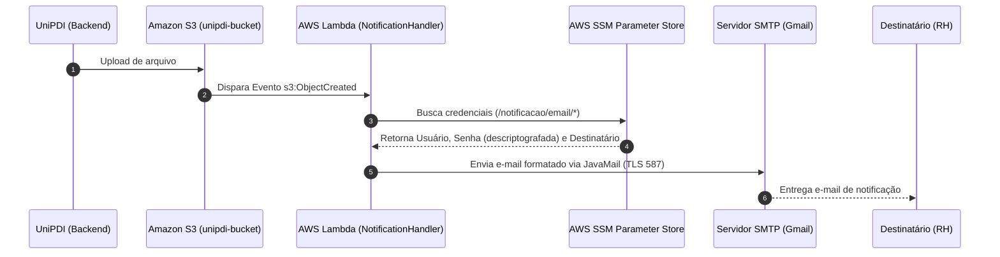
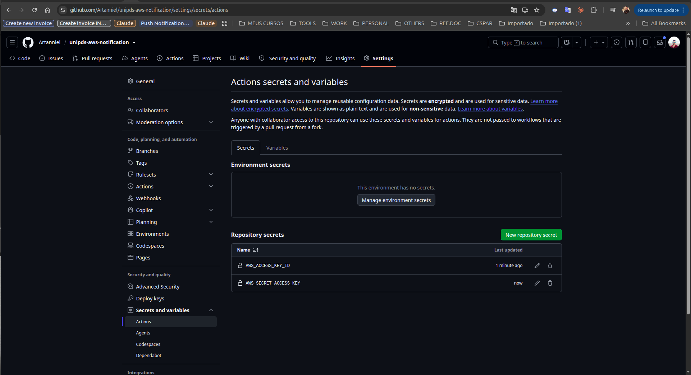

# 📬 UniPDS AWS Notification Lambda Service

> Serviço Serverless em Java 21 para envio de notificações automatizadas por e-mail acionado por eventos do Amazon S3 e integrado ao AWS Parameter Store (SSM).

---

## 🔗 Relação com o Sistema UniPDI

Este repositório é um **microsserviço serverless complementar** ao ecossistema **UniPDI**.

- **Repositório Principal UniPDI**: [unipds-modulo7-cloud-infra-unipdi](https://github.com/Artanniel/unipds-modulo7-cloud-infra-unipdi)

### 💡 Como os projetos se relacionam:

1. **Upload via UniPDI Backend**: Quando um usuário envia um arquivo (ex: currículo ou documento) através da aplicação principal [UniPDI](https://github.com/Artanniel/unipds-modulo7-cloud-infra-unipdi), o backend realiza o armazenamento do objeto no bucket Amazon S3 (`unipdi-bucket`).
2. **Gatilho (Event Trigger)**: O Amazon S3 intercepta o evento `s3:ObjectCreated:*` e dispara autonomamente esta função AWS Lambda (`unipds-aws-notification`).
3. **Busca Segura de Segredos**: A Lambda consulta o **AWS Systems Manager (SSM) Parameter Store** para descriptografar com segurança as credenciais SMTP (`/notificacao/email/user`, `/notificacao/email/pass`) e o e-mail de destino (`/app/email/rh`).
4. **Envio da Notificação**: A Lambda compõe a mensagem contendo o nome do arquivo enviado e o nome do bucket, disparando o e-mail de notificação para a equipe responsável (RH).

---

## 🏗️ Arquitetura do Fluxo



---

## 🚀 Tecnologias Utilizadas

- **Java 21**
- **AWS Lambda Core & Events SDK** (`aws-lambda-java-core`, `aws-lambda-java-events`)
- **AWS SDK for Java (SSM)** (`aws-java-sdk-ssm`)
- **Spring Boot Starter Mail** (`JavaMailSenderImpl`)
- **Apache Maven & Maven Shade Plugin** (Geração de Fat/Uber JAR)
- **GitHub Actions** (Pipeline CI/CD automatizado para build e deploy na AWS)

---

## 🔐 Parâmetros do AWS SSM Parameter Store

A função Lambda necessita que os seguintes parâmetros estejam previamente cadastrados no **AWS Systems Manager Parameter Store**:

| Parâmetro | Tipo | Descrição |
| :--- | :--- | :--- |
| `/notificacao/email/user` | `SecureString` / `String` | Endereço de e-mail do remetente (ex: `exemplo@gmail.com`) |
| `/notificacao/email/pass` | `SecureString` | Senha de aplicativo SMTP (ex: 16 caracteres do Gmail) |
| `/app/email/rh` | `String` | Endereço de e-mail do destinatário (ex: `rh@empresa.com`) |

---

## 🛠️ Como Compilar o Projeto (Fat JAR)

Como o AWS Lambda exige todas as dependências empacotadas no mesmo arquivo, o projeto utiliza o `maven-shade-plugin` para gerar um **Fat JAR**.

Execute o comando Maven no diretório raiz do projeto:

```bash
mvn clean package
```

Após o build bem-sucedido, o arquivo empacotado estará disponível em:
```text
target/unipds-aws-notification-1.0-SNAPSHOT.jar
```

---

## 📦 Implantação na AWS Lambda

1. Acesse o **Console AWS Lambda** e crie ou selecione a função `unipds-notification`.
2. Em **Configuração do Handler**, defina:
   ```text
   com.artantech.unipds.NotificationHandler::handleRequest
   ```
3. Em **Código**, selecione **Fazer upload de arquivo .zip ou .jar** e envie o arquivo:
   `target/unipds-aws-notification-1.0-SNAPSHOT.jar`
4. Garanta que a **Execution Role** (Permissão IAM) da sua Lambda inclua a política `AmazonSSMReadOnlyAccess` para permitir a leitura dos parâmetros no Parameter Store.
5. Adicione um **Gatilho (Trigger)** do Amazon S3 apontando para o seu bucket (`unipdi-bucket`) para eventos `All object create events`.

---

## ⚙️ Esteira de CI/CD (GitHub Actions)

O projeto conta com uma esteira de integração e entrega contínuas configurada em `.github/workflows/deploy-lambda-notificacao.yaml`. A cada `push` efetuado no repositório, o GitHub Actions executa automaticamente:

1. Checkout do código-fonte.
2. Configuração do ambiente Java 21 (Temurin).
3. Compilação do projeto e geração do Fat JAR (`mvn clean package -DskipTests`).
4. Autenticação na AWS via credenciais configuradas.
5. Deploy do pacote gerado diretamente na função AWS Lambda (`unipds-notification`).

### Configuração de Secrets no GitHub:

Para garantir o funcionamento da esteira, defina os seguintes segredos em **Settings > Secrets and variables > Actions**:

| Secret Name | Descrição |
| :--- | :--- |
| `AWS_ACCESS_KEY_ID` | Chave de acesso IAM para autenticação na AWS |
| `AWS_SECRET_ACCESS_KEY` | Chave secreta IAM correspondente |

---

## 📸 Evidências Visuais e de Configuração

Abaixo estão os registros visuais das configurações da infraestrutura AWS e da esteira de CI/CD:

### 1. Configuração da Função AWS Lambda e Gatilho S3
A imagem exibe a função Lambda `unipds-notification` pronta para uso, com o gatilho S3 atrelado ao bucket de upload do UniPDI e o código empacotado via Fat JAR (~30.6 MB):


### 2. Configuração de Secrets no GitHub Actions
A imagem abaixo demonstra as credenciais da AWS salvas de forma segura no repositório do GitHub para automação do deploy via GitHub Actions:




